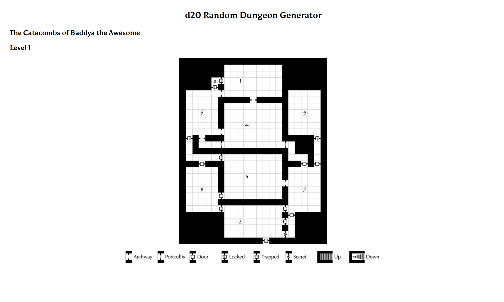

# CollisionDetection_NarrowPhase
This is a physics project for collision detection in our own custom game engine developed in OpenGL, GLFW, GLAD, totally from scratch in C++.

## Instructions for Physics Project 1 

use WASD to Move around

Collision doesnt allow you to walk out of the map

use left mouse click + mouse movement to look around.

use F to fire projectile 

use R to fire laser.

Please run in release for better performance

